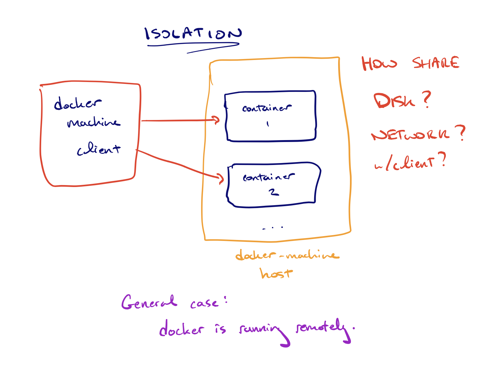
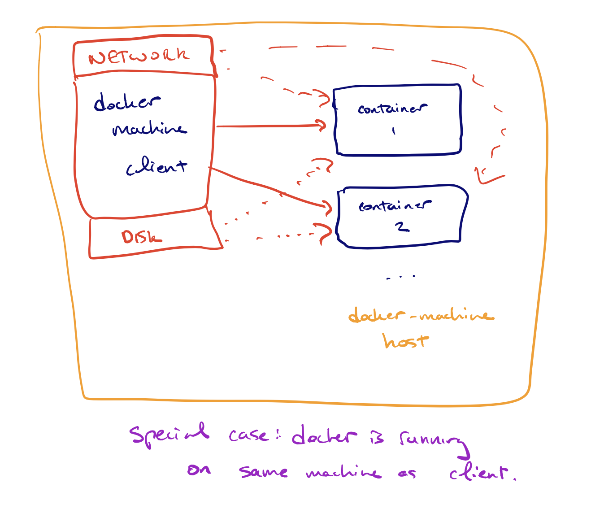
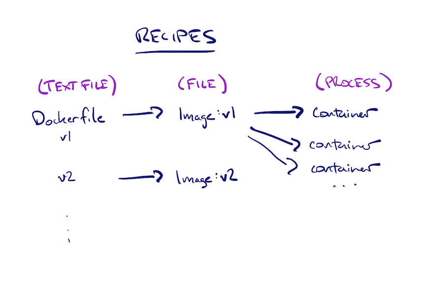
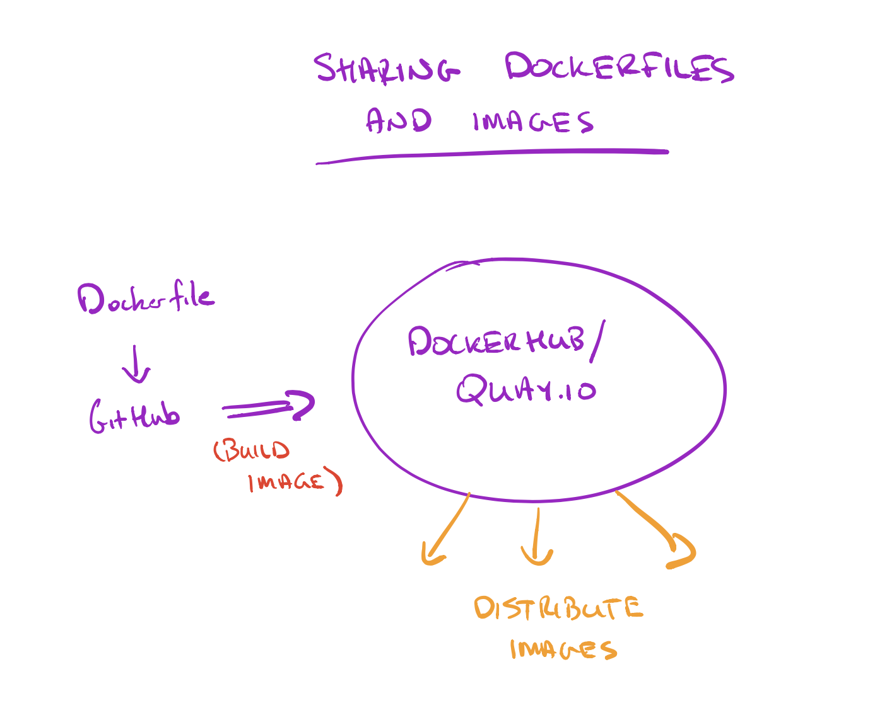

# A short workshop on Docker!

When: May 26, 2017, from noon - 1:30pm

Where: Data Science Initiative, UC Davis

Who: [C. Titus Brown](http://ivory.idyll.org/blog/), titus@idyll.org

## Before the workshop

### INSTALL IN ADVANCE

If your laptop has > 20 GB free disk space and > than 4 GB of RAM,
please try to install Docker!

For Mac OS X: https://docs.docker.com/docker-for-mac/install/ -
install the Stable Channel one.

For Windows 10: https://docs.docker.com/docker-for-windows/install/ -
Stable Channel.

If you can't install it, please drop Titus Brown an e-mail with
"Docker tutorial - cannot install" in the subject line and he will set
you up with a remote machine for the workshop.

### DOWNLOAD IN ADVANCE

If you've gotten Docker installed and running, please try to execute the following three commands:

```
docker pull ubuntu:14.04
docker pull rocker/tidyverse
docker pull jupyter/notebook
```

This is network intensive so it'd be nice if you could do it in advance!

----

Titus will also spin up a few instances on Jetstream (see
[boot instructions(https://2017-ucsc-metagenomics.readthedocs.io/en/latest/jetstream/boot.html)) for people to use.  The only trick here is that you need to do give your account permission to run docker, e.g.

```
sudo usermod -aG docker titus
```

## Introducing Docker








